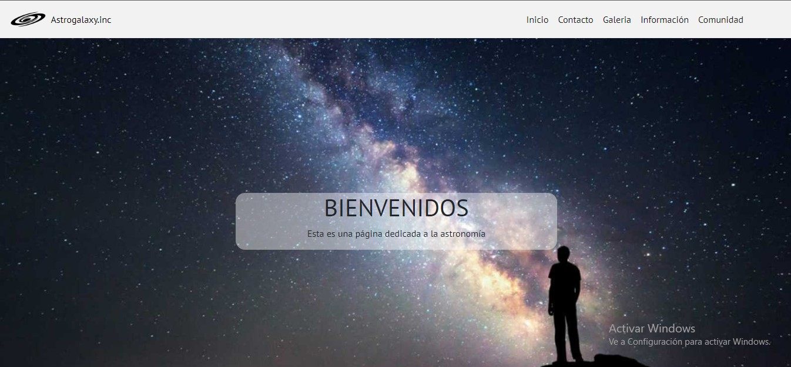

# Proyecto Final
Este es un proyecto dedicado a la creación de un blog sobre astronomía
con una finalidad plenamente educativa y abocada a la divulgación científica
Un sitio web que consta de 5 diferentes paginas divididas en:
*Index
*Comunidad
*Galeria
*Contacto
*Información

Cada una de ellas trata o muestra temas diferentes y a su vez cada una se divide
en diferentes secciones

## Estructura principal
1. **HEADER**
    * logo
    * título
    * barra de navegación
        1. Index
        2. comunidad
        3. galería
        4. contacto
        5. información

2. **MAIN**
    * diferentes secciones  
    * formularios
    * galería de imágenes

3. **FOOTER**
    * parte superior
        1. Imagen link a la web de la NASA [NASA](https://www.nasa.gov/)
        2. Nombre web - Autor - Patrocinadores
        3. Redes sociales
    * parte inferior
        1. *copyright* - nombre web

### Index: 
Consta de dos secciones, la primera **Eventos Astronómicos** donde muestra todos los 
eventos astronómicos que ocurríran en el mes. La segunda sección **Multimedia** nos
muestra sobre la **Estación Espacial Internacional** 

### Comunidad:
Sección de **Charlas** (*Temas de nuestras próximas conferencias*) y un **Formulario de Inscripción**
 a las mismas

 ### Galería 
 Sección única de una **Galería de Imágenes** en donde se muestran imágenes de planetas, galaxias, 
 nebulosas y además de otros temas referidos a la astronomía

### Contacto
**Formulario** de contacto, donde se piden todos los datos necesarios para responder a las consultas
de los usuarios 

### Información
Sección de **Carousel** de imágenes de los temas referidos a los enlaces que se mencionan en la sección de
**Card** con tarjetas que contienen imagen alusivas a las presentadas en el *carousel*, con una breve descripción del
tema y un enlace a sitios informativos sobre el tema descripto

